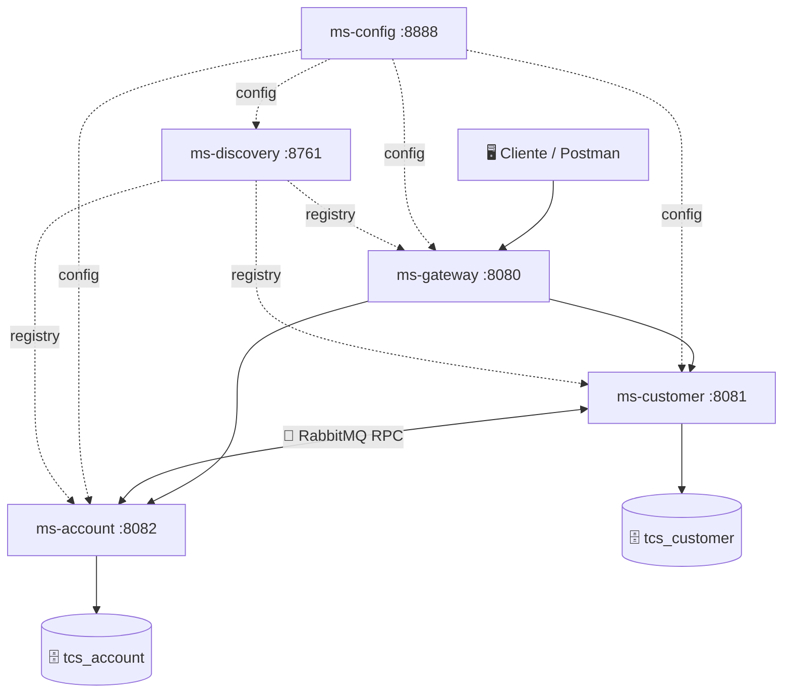

# TCS Fin Core — Backend Java Microservices

Arquitectura de microservicios con Spring Boot y Spring Cloud para gestión bancaria (clientes, cuentas y movimientos).

## 🗺️ Arquitectura general



## 🧩 Microservicios

| Servicio | Puerto | Descripción |
|---|---|---|
| ms-config | 8888 | Config Server centralizado (Spring Cloud Config, perfil native) |
| ms-discovery | 8761 | Eureka Server para service discovery |
| ms-gateway | 8080 | API Gateway (Spring Cloud Gateway MVC) |
| ms-customer | 8081 | CRUD de clientes, consumidor RabbitMQ |
| ms-account | 8082 | Cuentas, movimientos y reportes, productor RabbitMQ |

## ✅ Funcionalidades implementadas

| # | Descripción                                                          | Estado |                                                                                                                                                                                                
|---|----------------------------------------------------------------------|---|                                                                                                                                                                                                               
| F1 | CRUD completo de Clientes, Cuentas y Movimientos                     | ✅ |                                                                                                                                                              
| F2 | Registro de movimientos con actualización de saldo disponible        | ✅ |                                                                                                                                                 
| F3 | Validación de saldo insuficiente con mensaje `"Saldo no disponible"` | ✅ |                                                                                                                                          
| F4 | Reporte de estado de cuenta por rango de fechas y cliente            | ✅ |                                                                                                                                                     
| F5 | Pruebas unitarias de dominio (Cliente, Cuenta, Movimiento)           | ✅ |                                                                                                                                                    
| F6 | Pruebas de integración                                               | ✅ |                                                                                                                                                                      
| F7 | Despliegue completo en contenedores Docker                           | ✅ |

## 🛠️ Tecnologías

- Java 17 + Spring Boot 3.5.11
- Spring Cloud (Config, Eureka, Gateway)
- PostgreSQL 15 + Flyway
- RabbitMQ
- MapStruct + Lombok
- Docker / Docker Compose
- Maven

## 📋 Requisitos

- Docker y Docker Compose
- Maven 3.8+
- Java 17+

## 🚀 Levantar el proyecto

```bash
docker-compose up -d --build
```

El orden de inicio es automático:
1. PostgreSQL y RabbitMQ
2. ms-config
3. ms-discovery
4. ms-customer y ms-account
5. ms-gateway

## 🌐 Endpoints (via gateway)

| Recurso | Métodos |
|---|---|
| `/api/v1/customers` | GET, POST |
| `/api/v1/customers/{id}` | GET, PUT, DELETE |
| `/api/v1/accounts` | GET, POST |
| `/api/v1/accounts/{accountNumber}` | GET, DELETE |
| `/api/v1/movements` | GET, POST |
| `/api/v1/movements/{id}` | GET |
| `/api/v1/reports?customerId=&startDate=&endDate=` | GET |

Colección Postman disponible en: `tcs-fin-core.postman_collection.json`
Variable `{{base_url}}` = `http://localhost:8080/api/v1`

## 📖 Documentación API

Swagger UI disponible en cada servicio:
- ms-customer: http://localhost:8081/swagger-ui.html
- ms-account: http://localhost:8082/swagger-ui.html

## 🧪 Ejecutar tests

```bash
# Unit tests e integración
mvn test
```

## 🐇 Arquitectura de mensajería

La comunicación entre ms-account y ms-customer usa RabbitMQ

- **ms-account** → `Producer`
- **ms-customer** → `Consumer`